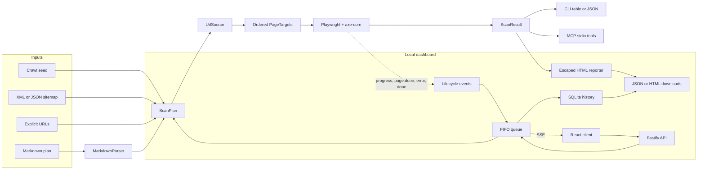

# Architecture

`a11y-page-checker` is a pnpm workspace built around a reusable scanning core. The core remains silent; terminal, HTTP, persistence, and presentation concerns belong to adapter packages.

## Packages

| Package | Responsibility |
| --- | --- |
| `@a11y-page-checker/core` | URL discovery, Markdown parsing, Playwright/axe execution, normalization, and typed events |
| `@a11y-page-checker/cli` | CLI validation, progress output, table/JSON output, and dashboard startup |
| `@a11y-page-checker/mcp` | Stdio MCP tools `audit_url` and `audit_markdown_plan` |
| `@a11y-page-checker/reporter-html` | Deterministic escaped HTML rendering and file output |
| `@a11y-page-checker/ui` | React dashboard, Fastify API, FIFO queue, SSE, and SQLite history |

## Core flow

`UrlSource` resolves sitemap, crawl, or explicit URL sources, normalizes and deduplicates URLs, overlays target metadata, and applies include/exclude path globs. A `files` source exists in the public union but currently rejects as unsupported.

`scan(plan)` preserves target order while limiting concurrent page scans. Each target gets its own page; page and browser resources are closed in `finally` blocks. Page-level errors are recorded on their URL result so unrelated targets can continue.

The normalized `ScanResult` is shared by every adapter. The CLI formats it, MCP serializes it, the reporter renders it, and the dashboard persists and exports it.

## Runtime boundaries

- Core emits lifecycle events and never writes to stdout or stderr.
- CLI and MCP are process adapters.
- The local dashboard listens on loopback, accepts browser input through a validated API, and owns persistence and queue state.
- The HTML reporter escapes untrusted result content before rendering.
