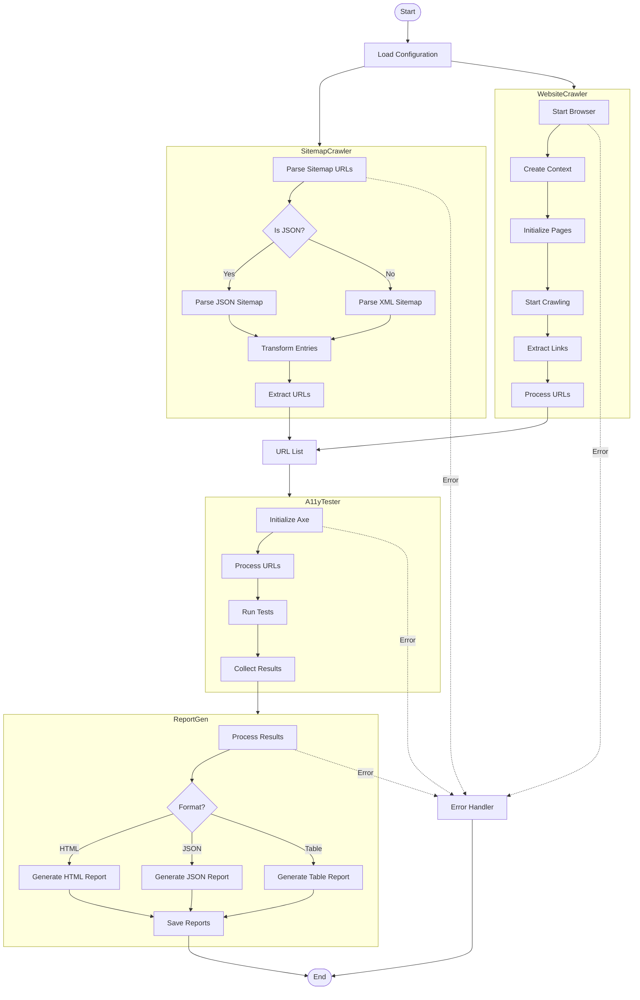

## Tool Workflow Explanation

1. **Configuration Loading**

   - Loads user configuration for crawlers, testing, and output
   - Validates configuration settings

2. **URL Discovery**

   - **Sitemap Crawler**
     - Supports both XML and JSON sitemaps
     - Extracts URLs and metadata
     - Handles retries and timeouts
   - **Website Crawler**
     - Uses Playwright for dynamic content
     - Follows links up to specified depth
     - Handles JavaScript-rendered content

3. **Accessibility Testing**

   - Uses Axe-core for testing
   - Processes URLs concurrently
   - Collects violations and results
   - Handles timeouts and errors

4. **Report Generation**

   - Supports multiple output formats:
     - HTML (interactive reports)
     - JSON (machine-readable)
     - Table (console-friendly)
   - Generates summary statistics
   - Includes detailed violation information

5. **Error Handling**
   - Graceful error recovery
   - Detailed error reporting
   - Retry mechanisms for failed requests
   - Timeout handling

## Key Features

- **Concurrent Processing**: Handles multiple URLs simultaneously
- **Format Flexibility**: Supports both XML and JSON sitemaps
- **Dynamic Content**: Can crawl JavaScript-rendered pages
- **Comprehensive Testing**: Uses Axe-core for thorough accessibility checks
- **Multiple Reports**: Generates reports in various formats
- **Error Resilience**: Handles failures gracefully with retries
